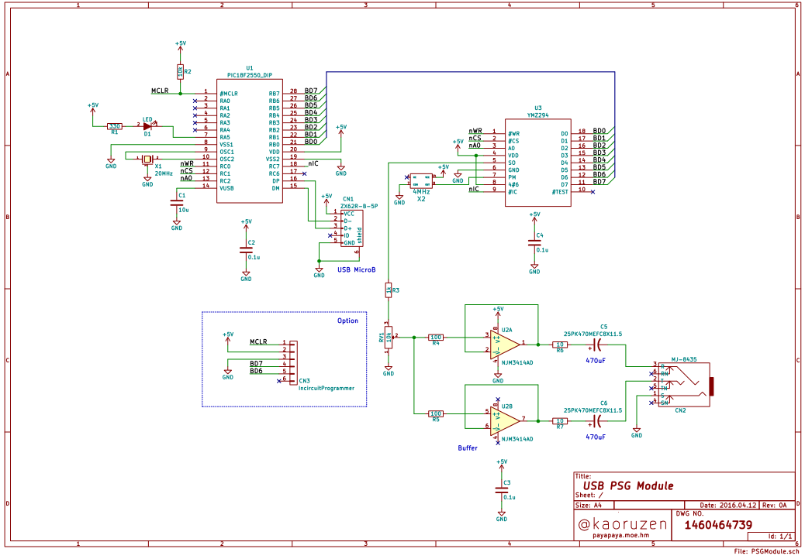
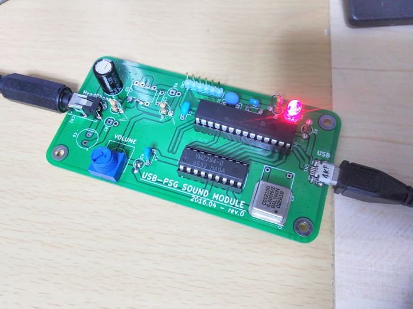

# USB-PSG Module (Yamaha YMZ294)

##Whats?
Yamaha YMZ294 PSG Sound LSI Controller.

##Schematic

##PCB

##Design Environment
*KiCad 4.0.2 Stable (Electronics and PCB)

*MPLAB X IDE v3.26 (PIC18F2550 Firmware)

*MPLAB C18 v3.47 Lite (PIC18F2550 Firmware)

*C# VisualStudio2015 (PC ControlSoftware)

C# Project - SMFPlay contains "SmfLite.cs" by Keijiro Takahashi. --Thanks.
[SmfLite - A minimal class library for handling standard MIDI files on Unity.](https://github.com/keijiro/smflite)